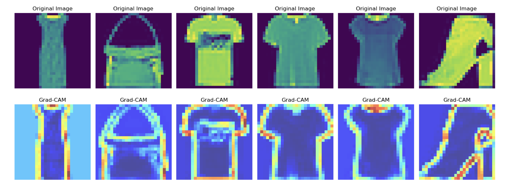
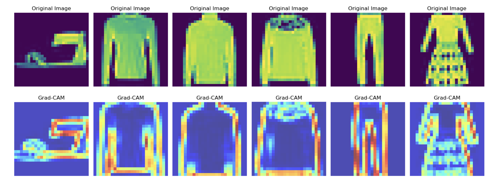

# Clothing Classification Using FashionMNIST Dataset

#### BLOG LINK - https://medium.com/@gpttamu/a-comparative-analysis-of-machine-learning-models-for-image-classification-of-fashion-items-using-7ae056802d3e

## Table of Contents

1. [Introduction](#introduction)
2. [Instructions to Run the Code](#installation)
3. [Dataset Overview](#usage)
4. [Models Trained](#features)
5. [Model Interpretability](#contributing)
6. [Project Report](#license)

## Introduction <a name="introduction"></a>
In this project, We are creating a classification model to accurately identify various articles of clothing using the FashionMNIST dataset, enabling accurate identification and categorization of various articles of clothing.

## Instructions to Run the Code <a name="installation"></a>

Prior to initiating the project, verify that all necessary dependencies are installed.

 #### Method 1 : 

Cloab Link: 
 
  #### Method 2 : 
1. Open a terminal or command prompt.

2. Navigate to the directory where your project is located.

3. Execute the following command to install the required dependencies specified in the requirements.txt file:

```
    pip install -r requirements.txt
```

## Dataset Overview <a name="usage"></a>

Prior to executing the code, ensure your data is structured as specified below and locate it within the "Data" directory:

Data - https://drive.google.com/drive/folders/1adq5kWrFdUy3TnWCA3Is3e7n1DT8YiGX?usp=sharing

## Models Trained  <a name="features"></a>

- Results 


| Model                 | Best Parameters                           | Accuracy |
|-----------------------|-------------------------------------------|----------|
| Convolutional Neural Network (CNN) | filters_layer1 = 64, filters_layer2 = 128, filters_layer3 = 256, kernel_size = (3,3)  | 92.07%   |
| Random Forest         | Default        | 86.7%   |
| K-Nearest Neighbors   | Default        | 86.9%   |


## CNN Model Interpretability Using Grad-CAM <a name="contributing"></a>

In this project, Grad-CAM was employed as a crucial interpretability tool to visualize and comprehend the decision-making process of the Convolutional Neural Network (CNN) model. Grad-CAM facilitates understanding by highlighting the regions within images that heavily influence the model's predictions, aiding in discerning which parts of the input image contribute most to the model's classification decisions.





In the provided image above, the Grad-CAM heatmap illustrates the regions contributing significantly to the model's classification decision. These visualizations are instrumental in explaining the CNN's behavior, providing valuable insights into its inner workings.


## Project Report <a name="license"></a>

Refer to the project_report.pdf file in this repository for a comprehensive report detailing the data preparation, exploratory data analysis, model selection, evaluation metrics, interpretability, and business insights.

